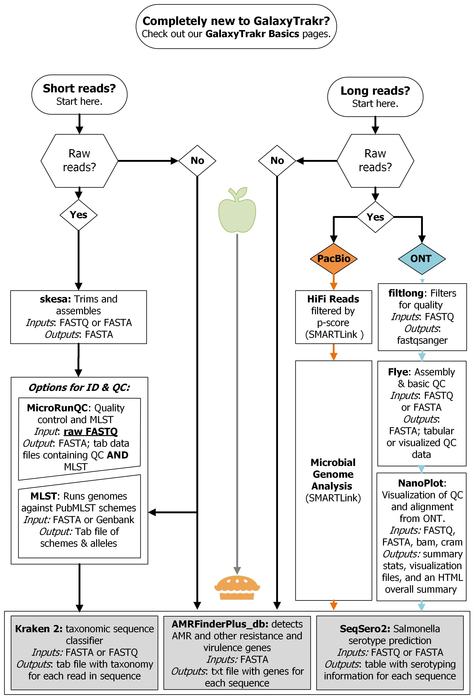

# microseqtrain.github.io
Care & Feeding of the MicroSeqTrain GitHub Pages Site

Intro to GitHub Pages and MicroSeqTrain structure
GitHub Pages turns a GitHub repository into a webpage. I have not used the Jekyll static website generator that is based in markdown and is the default for GitHub Pages. Jekyll is not currently approved by the FDA HFP. Instead, I have used html and css. If you prefer to edit code in GitHub Pages, you can do so. However, I have used Notepad++ to create pages. Those files were then uploaded to the GitHub Pages repository in one branch along with the images and txt example files needed for each tool’s page.
Creating a new tutorial page
To create a new tutorial page, it will be easiest to open the file of an existing page, copy all of the text, and paste it into a new file. If you are using Notepad++, go ahead and save that file as an html file so you have the benefit of Notepad++’s color coding. For a new tutorial, you will need to edit the following:
-	The title in the head of the page, which can maintain the “MicroSeqTrain | [ToolName] Tutorial” format.
-	Add a link to the tool’s page in the appropriate section of the sidebar menu using the format <li><a href=”[link]”>[ToolName]</a></li>
-	The tutorial’s name where you see the <h2>
[Title]
</h2> in the body
-	The contents of each individual section, possibly including the following.
o	Operation
o	References
o	Video Walkthrough
o	Examples
Save the file and either upload it to the GitHub repository by clicking “Add File” > “Upload File>” and either dragging the file into or searching for the file in the browser. Once you are satisfied with the files you are going to add, click “Commit Changes.” Add any notes you would like about the additions to the popup box. It will be a few minutes before your new page appears in response to trying to navigate to it. 
Important: place a copy of the file into the SharePoint site for the training repository so that there is a backup. 
Important 2: Edit the rest of the html files so that they contain the new link to the new page in the same space as you placed it in this file. You can follow the steps in the next section to do so.

Editing an html page
To edit a page, you have the option of either downloading the html file from SharePoint or GitHub and editing in your text editor of choice, like Notepad++ or editing in GitHub itself. To do the former, perform edits in the downloaded file and upload the new version of the file to both the SharePoint and GitHub. Note: remember that the file will need to have the same name as the old version when it is GitHub or your links will be broken.
If you are going to edit in GitHub, click on the file you would like to edit, then click on the pencil icon close to the top of the screen on the right. Make your edits in the resulting in-browser text editor, and click “Commit Changes.” Make any notes you would like to in the resulting popup and do not branch the repository unless necessary. After the changes are committed, make sure to download a copy of the file to upload to the SharePoint folder. Rename the old version of the file in SharePoint first so that they will not conflict and you have an old copy for your records. 

Creating new sections in a tutorial html
1.	Copy from <section class=”collapsible-section”> to </section> of the code of one of the collapsible sections. 
2.	Paste section where you would like, following it and preceding it with a   tag if you need line breaks to add spacing in that location.
3.	Give the section a title by replacing the text in between “<label for=”collapse[n]” class=”collapsible-lable”></label> tags.
4.	Enter the text of the tutorial between the 

 tags.
Files to Keep in the Repository
.nojekyll
It will not be immediately obvious why there is a file called cryptically “.nojekyll” in the repository. It exists to turn of Jekyll, which is the filetype that GitHub looks for by default to run GitHub Pages. Jekyll is not currently a supported program at FDA HFP. It is a static website generator that uses Markdown language to create Pages. It would be a helpful addition to FDA HFP’s applications if GitHub Pages continue to be used.

README
This file contains a copy of these instructions. Edit it as you see fit, but retain it for future use.

Adding images to the site
Both CSS files included in V1 of the site, the one of tutorials and the one for the index page, already contain formatting for images. If you would like to 
Here is an example of html and css used for an image used in the site, the flow chart included on the index page. You can use similar for other images, although you may not want them to be as big, especially if they are in the collapsable sections of tutorials:

Note: GitHub Pages will also support .png files, but I have not tested whether these settings will work as successfully for them.
Adding videos to the site
Videos can be added to where they are currently planned (“This is where the video…”) in the collapsable sections of the site by using the following code. Replace “x” with the video link from YouTube. Change the width and height as needed to work well with the collapsable section.
<iframe width="420" height="315"
src="x">
</iframe> 
 
Maintaining the microseqtrain@fda.hhs.gov Email Address
MicroSeqTrain users are directed to email the  microseqtrain@fda.hhs.gov email address if they need assistance with or have ideas about the tutorials on the site. If you have been added to the email list, the project should show up in your menu of email addresses that you can check in Microsoft Outlook. Please monitor this address periodically to make sure no inquiries have been lost. Additionally, the FDA department in charge of maintaining email addresses will purge addresses for inactivity from time to time. If they continue doing this as they have before, there will be an email sent to the MicroSeqTrain email to indicate that a purge is imminent. Be on the lookout for this email, if the address has not been used in a while, and perform the necessary steps to keep the inbox open. IT support who helped re-open the address advised checking the inbox weekly or even daily.

